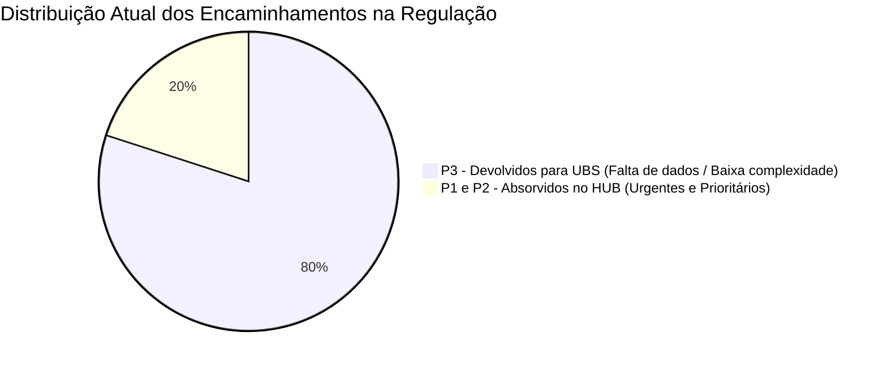
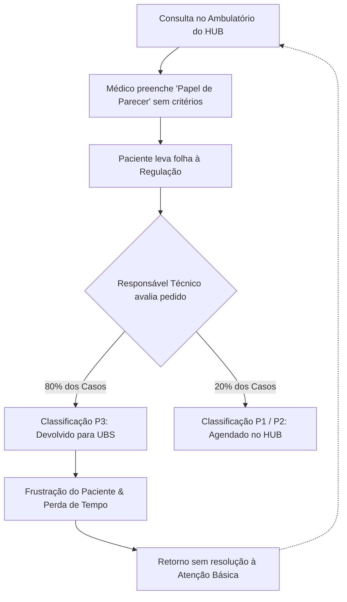

# :material-clipboard-pulse-outline: Diagnóstico Situacional

Este documento apresenta a análise contextual e o diagnóstico situacional do **Ambulatório de Saúde Integral** do Hospital Universitário de Brasília (HUB - UnB), evidenciando os desafios enfrentados no fluxo de regulação e na comunicação entre os níveis de atenção do Sistema Único de Saúde (SUS).

---

## :material-alert-circle-outline: O Problema: A Fragilidade do "Papel de Parecer"

Atualmente, o processo de encaminhamento e contrarreferência dentro do ambulatório ocorre por meio do chamado **"papel de parecer"** — uma folha física avulsa, sem formatação estruturada ou campos orientadores pré-estabelecidos.

Nesse modelo analógico, o médico assistente frequentemente registra apenas anotações breves, lacônicas e sem critérios clínicos objetivos, como por exemplo:

!!! danger "Exemplo Real de Registro Despadronizado"
    > *"Glicemia alterada, encaminho para endócrino."*

### Consequências do Preenchimento Despadronizado

- **Ausência de Histórico Clínico**: Faltam dados essenciais sobre tratamentos prévios já instituídos, dosagens utilizadas, exames complementares recentes e o real motivo da necessidade de intervenção especializada.
- **Ilegibilidade e Perda de Informações**: Por se tratar de preenchimento manual em papel volante, há perda frequente de dados, dificuldades de leitura e impossibilidade de rastreabilidade sistêmica.
- **Sobrecarga do Paciente**: O usuário torna-se o portador físico daquele documento, transitando entre setores sem a garantia de que seu caso será devidamente absorvido ou compreendido.

---

## :material-hospital-building: O Perfil do Hospital: Hospital Terciário e Ultraespecializado

O **Hospital Universitário de Brasília (HUB - UnB)** é uma unidade de **atenção terciária e quaternária**, com vocação para atendimentos de alta complexidade, ensino universitário e pesquisa clínica.

!!! warning "Vocação Assistencial e Riscos de Desvio de Finalidade"
    Condições crônicas comuns — como **hipertensão arterial sistêmica (HAS)** e **diabetes mellitus (DM) não complicadas** — possuem diretrizes clínicas estabelecidas para serem integralmente acompanhadas na **Atenção Primária à Saúde (APS)**, nas **Unidades Básicas de Saúde (UBS)**.

Quando um paciente com uma condição de baixa complexidade ou manejo ambulatorial básico é encaminhado indevidamente ou retido no HUB:
1. **Ocorre a ocupação indevida de vagas especializadas**, gerando filas reprimidas e espera prolongada para pacientes com patologias refratárias, raras ou graves que dependem exclusivamente da infraestrutura terciária.
2. **Há descontinuidade da linha de cuidado na APS**, enfraquecendo o vínculo longitudinal que as equipes de Saúde da Família devem manter com o cidadão em seu território.

---

## :material-scale-balance: O Fluxo de Regulação e o Gargalo das Devoluções (P3)

Após o atendimento ambulatorial, o paciente recebe a folha do "papel de parecer" e a encaminha ao setor de **Regulação Interna** do hospital. 

A avaliação e triagem dos encaminhamentos é conduzida pelo **Responsável Técnico (RT)** do ambulatório, que classifica cada solicitação segundo três níveis de prioridade clínica:

- :material-lightning-bolt: **P1 — Urgente**
    ---
    Casos com risco iminente de agravo severo à saúde, descompensações agudas ou suspeitas de alta gravidade que demandam atendimento especializado imediato no HUB.

- :material-clock-alert-outline: **P2 — Prioritário**
    ---
    Casos de complexidade intermediária ou patologias que necessitam de intervenção especializada em tempo hábil para evitar deterioração do quadro clínico.

- :material-keyboard-return: **P3 — Devolvido para a UBS**
    ---
    Casos que não atendem aos critérios de atenção terciária ou cujas informações clínicas são insuficientes para justificar a vaga no ambulatório especializado, sendo devolvidos para continuidade na Atenção Básica.

### O Impacto Crítico na Gestão de Vagas

!!! failure "Dado Alarmante: 80% de Devoluções em P3"
    Atualmente, em decorrência direta da falta de critérios no preenchimento do papel de parecer e da escassez de dados clínicos nas solicitações, **cerca de 80% de todos os encaminhamentos são classificados como P3 (devolvidos para a UBS)**.

### O Círculo Vicioso Gerado

1. **Desperdício de tempo e recursos**: O médico gasta tempo emitindo o documento; o paciente enfrenta filas e deslocamentos até a regulação; e o responsável técnico precisa decifrar e indeferir a solicitação.
2. **Frustração do usuário**: O paciente vivencia a expectativa de um agendamento e a subsequente negativa, muitas vezes sem entender o motivo de sua devolução à UBS.
3. **Justificativa para a Solução Digital**: Fica evidente a necessidade de uma ferramenta tecnológica que atue no ponto de cuidado, fornecendo suporte à decisão, campos obrigatórios orientados por protocolos clínicos e direcionamento correto do paciente no ecossistema de saúde.
